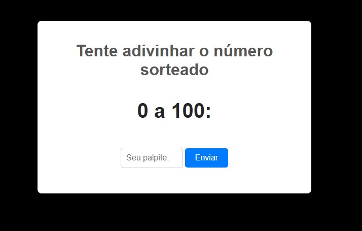

# 🎯 Zero a Cem

Um jogo simples, mas desafiador, onde **o objetivo é NÃO acertar o número sorteado!**  
Você vence quando **encurrala** o número secreto, ou seja, quando os palpites deixam o número sorteado exatamente entre dois valores consecutivos.

<br>

## 🕹️ Como jogar

1. O número secreto é sorteado entre **0 e 100**.
2. Você começa com os limites visíveis na tela.
3. Insira seu palpite e clique em **Enviar**.
4. O jogo informará se o número é **maior** ou **menor**.
5. Você **vence** se acertar o número.
6. O jogo informará quantas tentativas você precisou para acertar.e `31`.

---

## 🛠️ Tecnologias utilizadas

<div style="display: flex; gap: 10px; align-items: center;">
  
  
  
</div>

---

## 📷 Preview

git clone https://github.com/EvandroJMoreira/gameZeroACem/blob/main/img/zeroACem.jpg?raw=true



---

## 🚀 Como rodar localmente

1. Clone o repositório:
   ```bash
   git clone https://evandrojmoreira.github.io/gameZeroACem/

